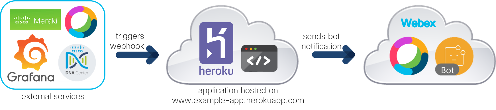

# Automated Webex Bot Deployment to Heroku

A Python application to automatically deploy a Webex Bot to Heroku using the [Heroku Platform APIs](https://devcenter.heroku.com/categories/platform-api).

## Webex Bots Introduction

**Webex Bots**: [Webex](https://www.webex.com/) is Cisco's cloud collaboration platform and the [Cisco Webex for Developers program](https://developer.webex.com/docs/platform-introduction) opens up the platform to extend and customize the Webex experience. [Bots](https://developer.webex.com/docs/bots) are one example that can help users automate tasks, add external content, and gain efficiencies. There are different [types of bots](https://developer.webex.com/docs/bots#types-of-bots):
* **Notifier Bots**: Notifier bots typically respond to events in external services and post a summary in Webex. A bot that sends a notification about an alarm in Meraki is an example. 
* **Controller Bots**: Controller bots act as a text-based remote control for external services. Users can call the bot and ask it to take certain actions, such as updating configurations in Cisco DNA Center.  

**Heroku**: [Heroku](https://www.heroku.com) is a platform as a service (Paas), which is popular by developers to deploy and manage applications in the cloud. It officially supports languages such as Python, Node.js, or Java, and it provides an [API](https://devcenter.heroku.com/categories/platform-api) to automate services, which makes it easy to use and quick to setup. 

**Webex Bot on Heroku**: Webex bots are triggered using [webhooks](https://developer.webex.com/docs/api/guides/webhooks). Webhooks need to be configured to listen to a public URL, which is provided when hosting the application on a cloud service like Heroku. Heroku hosts the application and makes it publicly accessible at the URL it is hosted at, so that when a service is configured to send a message to the webhook, the application listens and responds. The application processes the request following the script that defines the actions of the bot and sends a notification in the name of the bot.

**External Services and Webhooks**: Examples of external services that can be configured to send messages or alerts to a webhook include Cisco solutions, such as Meraki or DNA, but also other services like Grafana. To deploy a controller bot in Webex, a webhook must be configured to respond to events within Webex, such as someone sending a message to the bot or adding the bot to a team space.
  

## Contacts
* Jara Osterfeld (josterfe@cisco.com)

## Solution Components
* Webex Bot
* Heroku
* Python

## Prerequisites
- **Webex Account**:  If you do not have a Webex account yet, you can create one [here](https://cart.webex.com/sign-up-webex) for free.

- **Bot**:
    - **Creation**:
         1. Go to the [Webex Developer website](https://developer.webex.com/docs/bots) to create a bot.
         2. Log in with your Webex credentials by clicking **Log in** on the top right corner.
         3. Click **Create a Bot**.
         4. Fill in the information for your new bot, and click **Add Bot** at the bottom of the page.
         5. On the next page, you will see your **Bot Access Token**. Copy the token and save it as it will not be shown again.
    - **Additional Information**: Depending on whether you are deploying a notifier or controller bot, follow the these steps: 
        - **Notifier Bot**: 
           - **Dedicated Team Space and Room ID**:
             1. Create a Webex Teams Space by following [these instructions](https://help.webex.com/en-us/hk71r4/Webex-Teams-Create-a-Space).
             2. Name the space.
             3. Add the bot to the space. Also add other users that should receive the bot notifications.
             4. Click **Create**.
             5. Go to the [Webex API documentation for Webex Teams Rooms](https://developer.webex.com/docs/api/v1/rooms/list-rooms) to retrieve the ID.
             6. Use the interactive API endpoint on the right of the page. Use your personal access token (enabled by default) and if you just created the space, you can use the query parameter *sortBy* with the value *created* to list that space as the first entry in the response. Click **Run** and note the *id* value for the space you just created from the returned response.
        - **Controller Bot**:
           - **Bot username**: Note down the username of the bot, which you can find on the information page of your bot listed on *My Apps* when logged in on www.developer.webex.com. The format is *bot-username@webex.bot*.

- **Heroku**: 
  - **Account**: If you do not have a Heroku account yet, [click here](https://signup.heroku.com/dc) to sign up for free.
  - **[Stack](https://devcenter.heroku.com/articles/stack) and [Buildpack](https://devcenter.heroku.com/articles/buildpacks)**: This app is based on the [Heroku-20 stack](https://devcenter.heroku.com/articles/heroku-20-stack) and since the application is written in Python, it uses the officially supported [Python buildpack](https://elements.heroku.com/buildpacks/heroku/heroku-buildpack-python). To customize this, you can edit the `app.json` file following the official [schema](https://devcenter.heroku.com/articles/app-json-schema).  

## Deployment

1. Clone this repository with `git clone <this repo>`.

2. Navigate to the `bot` directory and open the `bot.py` file. Take the following actions:
    - Depending on whether you are implementing a notifier or controller bot, uncomment the lines of codes as described in the file itself. 
    - Customize the behaviour of the bot. The default behaviour of the bot in this repo is to send a hard-coded message to Webex. Depending on the use case of your bot, this should be changed.

3. Create your own repository on GitHub and push all files in the `bot` directory (`app.json`, `bot.py`, `Procfile`, `requirements.txt`) to the repository following [these steps](https://docs.github.com/en/github/importing-your-projects-to-github/adding-an-existing-project-to-github-using-the-command-line).

6. Navigate to the `setup` directory and open the `credentials.yaml` file. Fill in the information and save the file: 
    
        heroku_username: ''     # your Heroku account username
        heroku_password: ''     # your Heroku account paswoord
        heroku_region: ''       # either 'eu' or 'us'
        webex_bot_token: ''     # the access token noted during bot creation
        webex_bot_email: ''     # for controller bots (see Prerequisites section), leave empty for notifier bots
        webex_room_id: ''       # for notifier bots (see Prerequisites section), leave empty for controller bots
        github_url: ''          # the URL of the GitHub repository created in step 3 of the installation*
        github_version: ''      # the version of the GitHub repository to be deployed, can be a branch name (e.g. master) or commit hash 

   NB: The GitHub URL is used to create the `source_blob` that is required to setup an app using the Heroku Platform APIs. For that matter, the repository must be public. If the repository is private, you will need to include a username and token according to the information provided [here](https://help.heroku.com/5WGYZ74Q/what-should-i-use-for-the-value-of-source_blob-when-creating-apps-via-the-platform-api).

6. (Optional) Create a Python virtual environment and activate it (find instructions [here](https://docs.python.org/3/tutorial/venv.html)).

7. In a terminal, navigate to the `setup` directory, and install the dependencies with `pip install -r requirements_setup.txt`.

8. Run the setup script with `python setup.py`.  

9. From the logging output written to the console while the script is running, note the URL the app is deployed. It has the following format: *https://app-name.herokuapp.com*. 

## Webhook Setup

- For **notifier bots**: 
    - The webhook URL must be configured in the external services. A few examples to for example send alerts on different platforms: 
        - Meraki: [Overview](https://documentation.meraki.com/General_Administration/Other_Topics/Webhooks), [Configuration](https://developer.cisco.com/meraki/webhooks/)
        - DNA Center: [Overview](https://developer.cisco.com/docs/dna-center/#!cisco-dna-center-release-1-3-1/cisco-dna-center---releases-131---event-management), [Configuration](https://developer.cisco.com/docs/dna-center/#!cisco-dna-center-release-1-3-1/process-steps)
        - Grafana: [Overview](https://grafana.com/docs/grafana/latest/alerting/notifications/), [Configuration](https://grafana.com/docs/grafana/latest/alerting/notifications/)
    - Once configured and a notification/alert is sent from the service to the URL, the bot takes action following the logic of the `bot.py` script.
- For **controller bots**, a webhook must be configured for the bot to respond to events within Webex. Follow these steps to set it up:
    1. Go to the [Webex API documentation for Webhooks](https://developer.webex.com/docs/api/v1/webhooks/create-a-webhook) to create a webhook for the bot. 
    2. Use the interactive API endpoint on the right of the page. 
        1. Use the bot access token in the Authorization field of the headers.
        2. Provide a name for the webhook in the name field of the body. 
        3. Provide the webhook URL in the targetURL field of the body. 
        4. Provide a resource in the resource field and an event in the event field of the body. For example, if you want the bot to respond to messages that are sent in a Webex space, enter *messages* as resource and *created* as event.
        5. Click **Run**. Ensure you receive a **200/OK** status message in the response. 
    3. You can now chat with the bot on Webex and it will take actions following the logic of the `bot.py` script. 
        - Take into account that a bot can only access messages sent to it directly. In group spaces, bots must be `@mentioned` to access the message. In 1-to-1 spaces, a bot has access to all messages from the user.

## License
Provided under Cisco Sample Code License, for details see [LICENSE](./LICENSE.md).

## Code of Conduct
Our code of conduct is available [here](./CODE_OF_CONDUCT.md).

## Contributing
See our contributing guidelines [here](./CONTRIBUTING.md).
